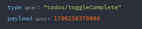

### 1. Jelaskan pengertian dari Redux, kapan sebaiknya digunakan dalam aplikasi?

> > > #### Jawab :
> > >
> > > > Redux adalah sebuah aplikasi State Management yang berfungsi menyediakan sebuah store pada state yang ada pada sebuah komponen-komponen di aplikasi web. Bagi anda yang mempelajari bahasa pemrograman pada tingkat lanjut maka aplikasi dapat menjadi sebuah tools dalam membantu untuk mengolah Javascript dan dikembangkan oleh Dan Abramov and Andrew Clark.

### 2. Jelaskan pengertian dari Reducer!

> > > #### Jawab :
> > >
> > > > Dalam artikel sebelumnya saya sudah memperkenalkan Redux, kali ini kita membahas lebih detail fitur-fitur dalam Redux. Secara garis besar Redux terdiri dari 2 bagian yakni Reducers dan Actions. Reducers adalah tempat mengeksekusi perintah untuk memanipulasi state (JSON) seperti crud, mengelola keranjang belanja dan lain-lain. Sedangkan Actions adalah tempat untuk menampung aksi yang berasal dari view (React Components). Reducers adalah berupa function-function yang di dalamnya terdapat struktur logika (biasanya menggunakan switch case) yang berfungsi untuk menentukan apa yang akan dieksekusi berdasarkan aksi yang dikirim melalui Actions. Gambaran sederhananya seperti ini:
> > > > Jika aksinya adalah "Add Todo"
> > > > Maka lakukan eksekusi untuk menambah data todo
> > > > Jika aksinya adalah "Delete Todo"
> > > > Maka lakukan eksekusi untuk menghapus data todo

### 3. Jelaskan fungsi store.getState() dan store.dispatch()!

> > > ### Jawab :
> > >
> > > > Jadi store.getState() adalah metode untuk memangil state saat ini di dalam store redux, mis disini akan memanggil objek, nah objek yang mewakili seluruh state aplikasi tersebut di sebut store.getState(), dan store.dispatch() metode yang digunakan di dalam objek untuk mengirimkan aksi(actions) ke dalam store Redux aksi atau action adalah bojek dari javascript yang mermiliki properti type, yang menjelaskan aksi yang akan dilakukan contoh yang telah saya buat disini saya ingin menjalankan tambah list maka action/type yang berjalan ialah. type:"todos/addTodo"
> > > > 

### 4. Buat Aplikasi sederhana Todo App menggunakan React dan Redux, action yang ada di reducer: addTodo, completeTodo, removeTodo,

### 5. Push jawaban ke branch dev/ojt-09-redux
